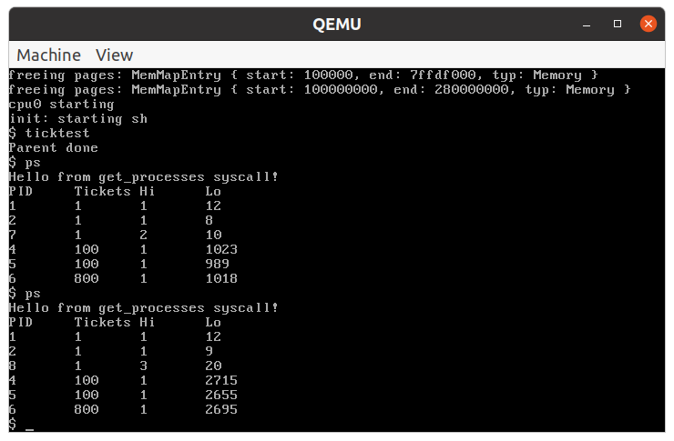
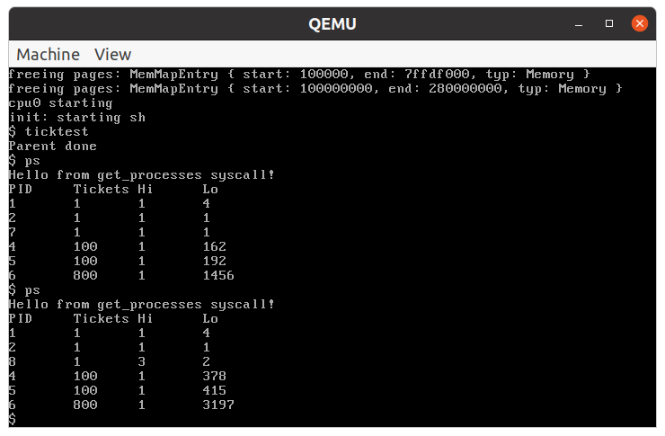

# The rxv64 Operating System

rxv64 is a pedagogical operating system written in Rust that targets
multiprocessor x86_64 machines. It is a reimplementation of the xv6
operating system from MIT.

As a pedagogical system, it supports very little hardware other than
the text-mode CGA device, serial port, PS/2 keyboard controller, and
PCIe AHCI SATA storage devices.

See the xv6 README for more information on provenance and intended
use.

# Setup

## Usage

- Ensure QEMU is installed if you want to virtualize rxv64. The [QEMU Homepage](https://www.qemu.org/download/)
  has install instructions for building or installing for a number of target
  operating systems.
- `ld.lld` is required for building user programs. On Ubuntu this can be installed with

```bash
sudo apt-get install lld
```

1. Build mkfs

```bash
cd bin
make mkfs
```

2. Make `sdahci0.img`

```bash
dd if=/dev/zero of=sdahci0.img bs=1M count=1024
```

This creates a blank image for QEMU to use. This command
will initialize `sdahci0.img` as a 1 gigabyte file full of
null bytes.

3. Build, run, or test

```bash
# Build with 8 cores and Round Robin scheduler
cargo xtask build
cargo xtask run # Runs rxv64 virtually in QEMU
cargo xtask test # Runs unit tests
```

```bash
# Build with 1 core and Priority + Lotto scheduler
cargo xtask build_prio
cargo xtask run_single
```

4. Build user programs

```bash
cd bin
sh mk
```

### Troubleshooting

While attempting to `test`/`build`/`run` received:

```bash
error: failed to install component: 'rust-src', detected conflict: 'lib/rustlib/src/rust/Cargo.lock'
```

Resolved by reinstalling the nightly toolchain

```bash
rustup toolchain remove nightly-x86_64-unknown-linux-gnu
rustup install nightly-x86_64-unknown-linux-gnu
```

# Modifications

### Objective

In this exploration, our aim is to enhance the built-in scheduler of rxv64. Out of the box, rxv64 operates with a basic
round-robin scheduler. This project aims to augment this default mechanism with an optional two-level scheduler. This
scheduler leverage the Multi-level Feedback Queue (MLFQ) and Lottery Scheduler to prioritize new processes and manage
resources allocated to long-running processes.

## Random Number Generation

The lottery scheduler requires random number generation in order to select a process to run. Rxv64 does not provide
a random number generator so pseudo-random number generation will be done with
a [Linear Congruential Generator](https://en.wikipedia.org/wiki/Linear_congruential_generator).

This struct represents a Linear Congruential Generator (LCG), a method employed for generating pseudo-random numbers
efficiently.

```rust
pub struct LinearCongruentialGenerator {
    seed: u32,
    // Initial value used for generating random numbers.
    start: u32,
    // The beginning value of the range for generating random numbers.
    end: u32,
    // The ending value of the range for generating random numbers.
    multiplier: u32,
    // A value by which the seed is multiplied.
    increment: u32,
    // A value added to the product of the seed and multiplier.
    modulus: u128, // The value by which the sum of the product and increment is divided.
}
```

### Methods

- `new(seed, start, end, multiplier, increment, modulus)`: Initializes a new LinearCongruentialGenerator with specified
  values.
- `default()`: Initializes a new LinearCongruentialGenerator with default values used by the Borland Software Company
- `next(max)`: Computes a new random number within the range [0, max] and sets it as the seed for the next iteration.
  The
  new random number is returned.

## Scheduler

### Criteria

#### Multi-Level Feedback Queue (MLFQ):

- New processes are placed in a high-priority queue for a single time slice.
- On interrupt, processes transition to a low-priority queue for two additional time slices.

#### Lottery Scheduling:

- Tasks are allocated tickets, proportionally enhancing their probability of being scheduled.
- A number will be drawn at random in the range of the total ticket sum
- Tickets will be summed until it exceeds the drawn number, the associated process will be scheduled next.

### Implementation

#### System Calls

- `getpinfo()`: Returns a struct containing process IDs, tickets, and the number of time slices each process has spent
  in the high and low priority queues.
  ```rust
    pub struct ProcStats {
      in_use: [u32; param::NPROC],
      pid: [u32; param::NPROC],
      tickets: [u32; param::NPROC],
      hi_ticks: [u32; param::NPROC],
      lo_ticks: [u32; param::NPROC],
    }
    ```

- `settickets(n)`: Sets the number of tickets allocated to the process.

#### Constraints

By default, rxv64 is configured to run with 8 cores. This basic implementation of the scheduler is designed to run on a
single core and, while it can generally be run on multiple cores, processes can not be guaranteed to be scheduled as
expected.

### Validation

In order to validate the scheduler, two user programs were created. The first program, `ps` uses the `getpinfo()` system
call
to print the process information for the active processes. The second program, `ticktest` creates a number of processes
and
uses `settickets(n)` to allocate tickets to each process. The processes then perform some arbitrary, time-consuming
work.
The `ps` program can then be used to demonstrate that processes are being scheduled relative to the number of tickets
they hold.

## Results

In order to demonstrate the effectiveness of the scheduler, the `ticktest` program was run with 3 processes. Two of
which
were allocated 100 tickets and the third was allocated 800 tickets. This should result in the third process being
scheduled
approximately 80 percent of the time while the other two processes are scheduled approximately 10 percent of the time.

### Round Robin Scheduler


First, the experiment was run with the default round robin scheduler. As expected, the processes were scheduled
approximately equally.

Note - due to modifications to the `Proc` struct and `trap` handler, processes are placed on the high priority queue
and then moved down to low priority, even when building and running with the default scheduler.

### Priority Scheduler


Next, the experiment was run with the priority scheduler. The above screenshot shows that each process was scheduled
for one time slice on the high priority queue before being moved to lower priority. From there, the third process
received approximately 80 percent of the time slices as expected while the other two processes each received
approximately
10 percent of the time slices.

# Next Steps

The current implementation works as expected but only on a single core. One possible solution to support multiple cores
would be to implement an asymmetric scheduler. One core would be responsible for scheduling processes on all other cores
while the other cores would be responsible only for executing the scheduled processes.

### Rescoures to Explore

[University of Wisconsin - Multiprocessor Scheduling](https://pages.cs.wisc.edu/~remzi/OSTEP/cpu-sched-multi.pdf)